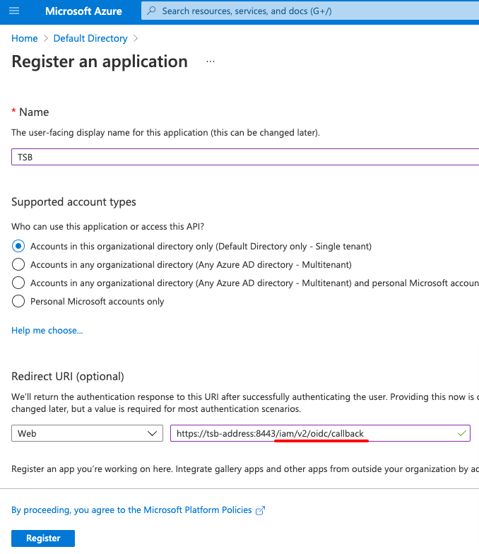
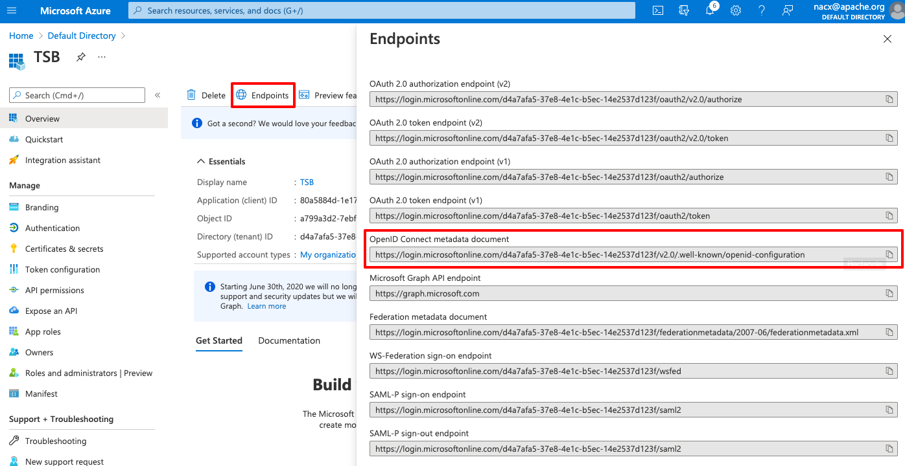

This document describes the steps required to create an application in Azure to allow TSB use the cloud account for OIDC and user and group synchronization from Azure AD.

## Create the Application

Log in to the Azure portal and go to the *Active Directory > App Registrations > New application registration*.


Set the application type to Web and configure the Redirect URI to point to the TSB address and the **`/iam/v2/oidc/callback`** endpoint.



## Configure Application Secrets

Once the application is created, go to the *Certificates & Secrets* to create a client secret to be used in TSB:


Configure a name and an expiration, and click Add.


Once added you'll be able to see the **Value** of the secret. Copy it as it will be used later and it won't be shown again later.


## Configure OIDC Tokens

Once the secret has been created, go to the *Authentication* menu item and click on *Add a platform* to configure the OIDC tokens.


Select *Web*


In the next screen configure the Redirect URI to point to the TSB address and the **`/iam/v2/oidc/callback`** endpoint, select both tokens (Access tokens and ID tokens), optionally enable mobile and desktop flows for tctl device code flow:


## Configure Application Permissions

Once the application has been configured for OIDC, it needs to be granted permissions to let TSB synchronize the information about users and groups from Azure AD. To do that go go the  *API Permissions* and click on *Add Permission*:


In the next screen, scroll down to the bottom to select *Microsoft Graph* from the *Commonly used Microsoft APIs*:


In the next screen, set the permission type to *Application permissions*, from the list of permissions select the **_Directory.Read.All permission_**, and click the *Add permissions* button.


Once the permission has been added, click on the **Grant admin consent** button to grant the requested permissions to the application.


Once permissions are granted, the status should reflect that:


## Enable public workflow

You will need to enable the public workflow to allow the `tctl` command to login.
Login to the Azure portal and go to the "Authentication" section for the platform  which was created in the previous steps.

In the "Advanced settings" section, enable the option "yes" and click on Save.


## Configuring TSB

At this point you are done configuring the Azure side. You will now need to create Kubernetes secrets to store the Application's Client Secret, and configure the ManagementPlane.

The following data need to be obtained from the Azure application:
* Client ID
* Client Secret
* Tenant ID
* Configuration URL

The *Client ID* and the *Tenant ID* can be obtained in the Azure Application *Overview*.


The *Client Secret* is the "password" that you copied while configuring the Application secrets in the previous steps.

The *Configuration URI* can be copied from the application endpoints:



## Create the Kubernetes secrets

Create the secrets in a file named `secret.yaml` using the following command. Replace `TSB_Admin_Pass` and `Client_Secret` appropriately.


```bash
tctl install manifest management-plane-secrets --allow-defaults --tsb-admin-password <TSB_Admin_Pass>   \
    --oidc-client-secret=<Client_Secret> \
    --teamsync-azure-client-secret=<Client_Secret> > secret.yaml
```

Within the generated `secret.yaml` file, we only care about the values for `iam-oidc-client-secret` and `azure-credentials`. Edit the `secret.yaml` file and remove all other secrets, then apply the YAML file using `kubectl`. It is important to remove all other secrets, as you do not want to override them for this procedure.

```bash
kubectl apply -f secret.yaml
```

## Configure the ManagementPlane CR

Once the secrets have been created, configure the identityProvider section of the `ManagementPlane` CR by using the following command to start editing the CR:

```bash
kubectl edit managementplane managementplane -n tsb
```

Edit the contents of the CR in a similar manner as show below (only the relevant portions are shown in the example below). You will need to insert the `identityProvider` clause at the appropriate location in your `ManagementPlane` CR manifest.

```yaml
apiVersion: install.tetrate.io/v1alpha1
kind: ManagementPlane
metadata:
  name: managementplane
  namespace: tsb
spec:
  ( … )
  identityProvider:
    oidc:
      clientId: <the application client id>
      providerConfig:
        dynamic:
          configurationUri: <the application configuration uri>
      redirectUri: https://<tsb-address>:8443/iam/v2/oidc/callback
      scopes:
      - email
      - profile
      - offline_access
    sync:
      azure:
        clientId: <the application client id>
        tenantId: <the application tenant id>
```

:::note Helm installation
All of the examples for updating `ManagementPlane` CR provided in this document can also be applied to Helm installations. You can edit `identityProvider.oidc` in your management plane Helm values file.
:::

## End user TCTL configuration

There are two ways to configure the tctl using Azure OIDC
	
1. User based device code authentication with service principals.
2. User based device code authentication without service principals.

### User based Device Code authentication with service principals

Configure the identityProvider section of the `ManagementPlane` CR using the command `kubectl edit managementplane managementplane -n tsb` and  update  the offline section as follows:

```yaml
apiVersion: install.tetrate.io/v1alpha1
kind: ManagementPlane
metadata:
  name: managementplane
  namespace: tsb
spec:
  ...
  identityProvider:
    oidc:
      ...
      offlineAccessConfig:
        deviceCodeAuth:
          clientId: <the application client id>
```

Login with tctl using the current profile:

```bash
tctl login --use-device-code
```

### Service Principal for headless environments

Service Principal is an AzureAD term for tokens issued using OAuth Client Credentials grants. When Token Exchange grants are enabled in TSB, users can exchange an AzureAD Service Principal token for a TSB token.

In order to use the TSB token, a user record must be created in TSB with a user ID matching the subject claim from the AzureAD Service Principal, which is also the same as the Client ID from the AzureAD App Registration screen. In addition, the AzureAD App Registration must also set `accessTokenAcceptedVersion=2` in the App Manifest. This enables TSB to perform token checks required for the token exchange grant.

Edit the App Manifest and enable version 2 access tokens:


Configure the identityProvider section of the `ManagementPlane` CR using the command `kubectl edit managementplane managementplane -n tsb` and  update the offline section as follows:

```yaml
apiVersion: install.tetrate.io/v1alpha1
kind: ManagementPlane
metadata:
  name: managementplane
  namespace: tsb
spec:
  ...
  identityProvider:
    oidc:
      (...)
      offlineAccessConfig:
        tokenExchange:
          clientId: <the application client id>
```

Follow AzureAD documentation for [requesting a service principal token](https://docs.microsoft.com/en-us/azure/active-directory/develop/v2-oauth2-client-creds-grant-flow#get-a-token), and obtain your service principal token.

For example, using `curl`, you can issue the following command. Please consult the official documentation for details.

```bash
curl -X POST  \
  -H 'Content-Type: application/x-www-form-urlencoded' \
  -d 'grant_type=client_credentials&client_id=<clientID>&resource=<clientID>&client_secret=<clientSecret>' \
  https://login.microsoftonline.com/<directoryID>/oauth2/token \
  | jq -r '.access_token'
```

Acquire a temporary TSB token using a token exchange:

```bash
tctl login --use-token-exchange --access-token <azure service principal token>
```

:::note
The token exchange will only work with an AzureAD Service Principal matching the client ID configured in the ManagementPlane's `tokenExchange` configuration section.
:::

If everything is working, you should see a message telling you that you have successfully logged in.

## TCTL Device Code Login without service principals

Once OIDC is integrated in the cluster, end users are able to configure tctl to work with OIDC by using the login command with the --use-device-code parameter. The command will ask for the Organization and Tenant, and provide a code that can be used to authenticate on the provided URL. Once that code is validated, tctl will be ready to use.

```bash
tctl login --use-device-code

Organization: tetrate
Tenant: mp
Code: CXKF-TDKP
Open browser page https://aka.ms/devicelogin and enter the code
```

Alternatively, the tctl configuration can be downloaded from the UI. To do so, login into TSB click on the user info icon on the top right corner. Then click on "Show token information" and follow the steps UI shows to download and use the file.


